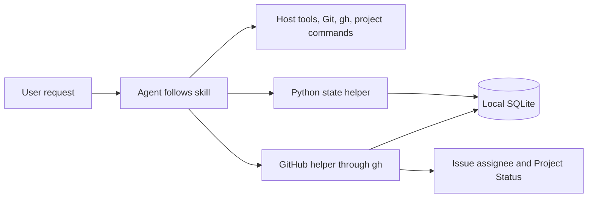
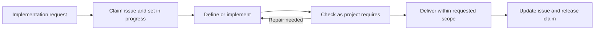

# Devflow

Small development skills for an agent, with Python helpers for work ownership, GitHub issue status and metrics. The agent follows the relevant skill and uses its host tools, Git, GitHub CLI and project commands directly.

## Prerequisites

Supply Python 3.12+, a POSIX shell, Git, a host that discovers `SKILL.md` directories, and the tools required by your projects. GitHub work requires authenticated `gh`; Project tracking also needs access to the selected existing Project (`project` scope for an OAuth token). Other tools need their usual authentication and permissions. Devflow does not check or install prerequisites or manage authentication; behavior with missing prerequisites is undefined.

## Install

Keep the clone at a stable location; installed skills are symlinks into it.

```sh
git clone git@github.com:ebarti/devflow.git
cd devflow
bash scripts/install.sh
```

The defaults are `~/.agents/skills` and `$CODEX_HOME/hooks.json` (`~/.codex/hooks.json` when unset). Supply custom locations when needed:

```sh
bash scripts/install.sh /path/to/host/skills /path/to/codex-home
```

Update the original clone to update linked skills. To switch an existing installation to another checkout, run this from that checkout:

```sh
bash scripts/install.sh --force
```

`--force` replaces only bundled skill symlinks, including broken links. Regular files, directories and other hooks are preserved. Without it, conflicting paths stop installation. Review and trust the metrics hooks with `/hooks`; use a fresh task after installation. Agent instructions and target repositories are not modified. Automatic collection requires a host supporting the documented Codex hook interface.

## Start

Ask for the outcome you want, for example: “Use devflow to fix the retry bug in this repository.” Or invoke a role such as `$devflow-reviewing` for a specific review. Skills are independently discoverable; loading one does not create work, issues or agents, or resume a backlog.

Delegated implementation defaults to **Sol / high** (`gpt-5.6-sol`). Explicit user or project choices override it. Other roles keep their selected models.

| Skill | Use |
| --- | --- |
| [devflow](skills/devflow/SKILL.md) | Shared method, role selection and state helper |
| [devflow-defining-work](skills/devflow-defining-work/SKILL.md) | Clarify outcomes and investigate unclear requests |
| [devflow-planning](skills/devflow-planning/SKILL.md) | Plan consequential changes and coverage |
| [devflow-coordinating](skills/devflow-coordinating/SKILL.md) | Carry out a defined request and recover ongoing work |
| [devflow-implementing](skills/devflow-implementing/SKILL.md) | Implement or repair code |
| [devflow-reviewing](skills/devflow-reviewing/SKILL.md) | Review a candidate and verify findings |
| [devflow-verifying](skills/devflow-verifying/SKILL.md) | Reproduce behavior and run project checks |
| [devflow-delivering](skills/devflow-delivering/SKILL.md) | Publish, merge or reconcile requested delivery |

## How it works



Enter at the role that fits the request. A small fix needs no separate planning exercise; a review-only request starts with review. Project rules determine checks, independent review and delivery requirements.



Independent issues follow this flow concurrently in separate worktrees. A coordinator may own several issues and dispatch their workers; each issue keeps one owner and work ID. One GitHub helper creates or reuses the issue, assigns the accountable user, adds it to the existing Project and updates its Status using the board's existing options. Use `state.py work list --claimed` to see task owners and their last observations. See [ownership and interruption handling](skills/devflow/references/ownership.md).

The state helper stores work, claims, runs, results and findings. Runtime hooks collect bound tasks' turns, tool timings, interruptions, compactions and token-counter deltas without storing prompt or command text. Claims attach coordinators automatically; children inherit a single issue. Multi-issue coordinator usage stays unallocated. There is no scheduler.

`state.py metrics` reports outcomes, roles/models, delivery, ownership, recovery, timing, usage and coverage; add `--work-id ID` for one issue. Missing observations stay unknown. Check acceptance and finding decisions remain explicit records. Costs require supplied estimates; complete workflow overhead and savings are not inferred. See [metrics and collection](skills/devflow/references/state.md).

The default database is `$XDG_STATE_HOME/devflow/workflow.sqlite3`, or `~/.local/state/devflow/workflow.sqlite3` when that variable is unset. See [helper commands](skills/devflow/references/state.md) and [storage contracts](docs/implementation-contracts.md).

## Installation smoke check

```sh
bash scripts/check-install.sh
```

Devflow CI runs only this installation smoke check. It does not run package test suites, review/QA gates or delivery automation. Target projects retain their own check policies.

[Architecture](docs/architecture.md)
