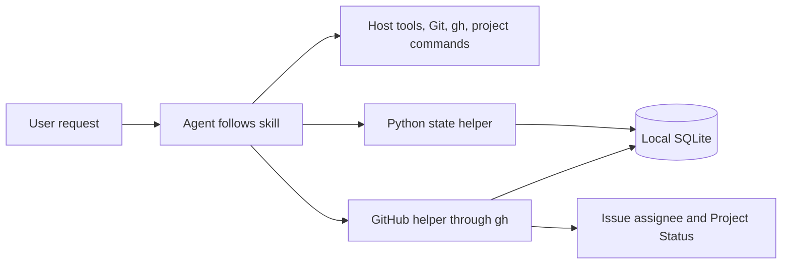
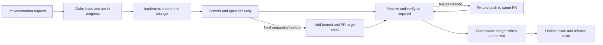

# Devflow

Small development skills for OpenAI Codex CLI agents, with Python helpers for work ownership, GitHub issue status and metrics. The agent follows the relevant skill and uses its host tools, Git, GitHub CLI and project commands directly.

## Prerequisites

Devflow targets Codex CLI: skills load from its skills directory, metrics hooks use its `hooks.json` and transcript format, and delegation uses its agent tools. Other hosts that discover `SKILL.md` directories can load the role skills, but hooks, metrics, candidate trials and worker spawning are Codex-specific. Supply Python 3.12+, a POSIX shell, Git and the tools required by your projects. Execution needs native nested-agent tools, capacity for the main task plus a coordinator and at least one leaf, and access to Astra and Sol. The installer supplies four agent definitions. See the [agents reference](skills/devflow/references/agents.md) and the [implementation worker reference](skills/devflow/references/implementation-worker.md). GitHub work requires authenticated `gh` and sequential stacks use the `gh stack` extension and skill; Project tracking also needs access to the selected existing Project (`project` scope for an OAuth token). Other tools need their usual authentication and permissions. Devflow does not install prerequisites or manage authentication. Check the tools needed for the requested action and report a missing prerequisite as a blocker rather than silently changing the workflow.

## Install

Keep a published release checkout at a stable location; installed skills are
symlinks into it, and agent definitions are symlinks or preserved matching
regular files. Set `RELEASE_TAG` to an approved,
published tag that contains the installer and agent definitions you intend to
use. To get the regular-agent compatibility in this PR, that tag must be
created after the change is approved and released; an open PR is not a release.

```sh
git clone --branch "$RELEASE_TAG" https://github.com/ebarti/devflow.git
cd devflow
bash scripts/install.sh
```

The installer uses `python3.12`; set `DEVFLOW_PYTHON` to select another supported interpreter. Hooks record its resolved absolute executable path at installation, so later `PATH` changes do not switch Python. Reinstall to change the interpreter. The helpers use only the standard library; no pip dependencies are required.

The installed hook keeps a checkout snapshot in Codex home. If that checkout
changes or a linked skill disappears, the hook reports installation drift before
loading source code. Check it directly with
`python3.12 "$CODEX_HOME/.devflow-hook.py" --check` (use `~/.codex` when
`CODEX_HOME` is unset), then restore the checkout or rerun installation.

The defaults are `~/.agents/skills` for skills and `$CODEX_HOME` (`~/.codex` when unset) for the agent definitions in `agents/` and the metrics hooks in `hooks.json`. Supply custom locations when needed:

```sh
bash scripts/install.sh /path/to/host/skills /path/to/codex-home
```

To switch an existing installation to another checkout, run this from that checkout:

```sh
bash scripts/install.sh --force
```

`--force` replaces only bundled skill and agent-definition symlinks, including broken links. Existing regular agent-definition files are preserved when byte-identical to this checkout's definitions; differing copies stop installation before any links change, even with `--force`. Skill paths still require symlinks. Other files, directories, agent definitions and hooks are preserved. Without `--force`, conflicting symlinks stop installation. Review and trust the metrics hooks with `/hooks`; use a fresh task after installation. Agent instructions and target repositories are not modified. Automatic collection requires a host supporting the documented Codex hook interface.

## Upgrade

Set `RELEASE_TAG` to the chosen [approved release tag](https://github.com/ebarti/devflow/releases)
and upgrade the existing checkout between tasks:

```sh
bash scripts/update.sh "$RELEASE_TAG"
```

The updater fetches that tag, checks out its commit and reruns installation. Reuse custom directory arguments and `DEVFLOW_PYTHON` when applicable. Tracked edits stop the upgrade. Obsolete skill and agent-definition links owned by this checkout are removed; other files and SQLite records are preserved. Supported database migrations run on the next helper use. Review changed hooks with `/hooks`, then start a fresh task. Updates are explicit; `main` contains unreleased work.

## Candidate trials

From a development worktree, use a new trial directory for each candidate and a separate target-project worktree:

```sh
python3.12 scripts/candidate.py /path/to/trial -C /path/to/project-worktree
```

The launcher isolates skills, agent definitions, hook configuration, sessions and SQLite, disables the normal Devflow skills in that session, and records the source commit in `candidate.json`. Its generated configuration selects Astra/xhigh for the main task and belongs to the trial. Authenticate that session with `candidate.py /path/to/trial login`, then review its hooks with `/hooks`. `--prepare-only` prepares the directories without starting a session. Freeze the candidate while a trial runs and retain its metrics with the recorded commit. A change still in an open PR belongs only in such a frozen review/trial checkout until it has an approved release tag.

Publish a new release tag after the installation smoke check and the selected product trial pass. Release tags remain fixed; normal installations advance only through an explicit upgrade.

## Start

Ask for the outcome you want, for example: “Use devflow to fix the retry bug in this repository.” Or invoke a role such as `$devflow-reviewing` for a specific review. Skills are independently discoverable; loading one does not create work, issues or agents, or resume a backlog.

Use **Astra/xhigh** for the main task. It inspects the repository, asks user questions and produces the plan itself. Select that model in the host; skills cannot change an existing task's model and normal installation does not alter global model settings. From the CLI:

```sh
codex --model gpt-6-astra -c 'model_reasoning_effort="xhigh"'
```

For implementation, the main task hands the inspected plan to one `devflow-coordinator` on **Sol/high**. That agent dispatches implementation on **Sol/xhigh** and review/verification on **Sol/xhigh**, owns the repair loop, maintains records and tracker state, and returns the consolidated outcome. Only material design decisions or unresolved blockers return to the main task. The coordinator inherits the main task's permissions for the shared database; leaf workers return reports.

The implementer commits the first meaningful change, opens a non-draft PR immediately, and pushes subsequent fixes to that PR. Explicit local-only, no-commit and no-push instructions take precedence.

Split features into coherent reviewable PRs. Features and slices developed sequentially while earlier work remains unmerged form one **gh stack**, even when they are logically independent. Each new branch and PR builds on its unmerged predecessor. See [PR workflow](skills/devflow/references/pr-workflow.md).

Reuse the original coordinator for continuation, implementer for repairs and reviewer/verifier for rechecks when the scope is still related. Dispatch only the roles the work needs. The execution coordinator performs the final authorized merge directly. Standalone review/verification uses the corresponding leaf directly; merge-only requests run in the main task. There are no definer, planner or delivery agents.

The [agents reference](skills/devflow/references/agents.md) lists the four delegated roles, default models and override mechanism. Briefs carry the inspected plan, acceptance conditions, candidate identity and verification limits. Reviewers and verifiers must still challenge demonstrated flaws in the plan. These are workflow instructions; this iteration does not add enforced input/output contracts or sequencing. The installed hook remains a backstop for common repository writes from the main claim holder and execution coordinator. Moving routine coordination to Sol aims to reduce expensive main-task turns; no cost saving is guaranteed or inferred from the topology alone.

| Skill | Use |
| --- | --- |
| [devflow](skills/devflow/SKILL.md) | Shared method, role selection and state helper |
| [devflow-defining-work](skills/devflow-defining-work/SKILL.md) | Clarify outcomes and investigate unclear requests |
| [devflow-planning](skills/devflow-planning/SKILL.md) | Plan consequential changes and coverage |
| [devflow-coordinating](skills/devflow-coordinating/SKILL.md) | Carry out a defined request and recover ongoing work |
| [devflow-implementing](skills/devflow-implementing/SKILL.md) | Implement, open PRs early and push repairs |
| [devflow-reviewing](skills/devflow-reviewing/SKILL.md) | Review a candidate and verify findings |
| [devflow-verifying](skills/devflow-verifying/SKILL.md) | Reproduce behavior and run project checks |
| [devflow-merging](skills/devflow-merging/SKILL.md) | Merge an authorized PR or gh stack |

## How it works



Enter at the role that fits the request. A small fix needs no separate planning exercise; a review-only request starts with review. Project rules determine checks, independent review and delivery requirements.



Independent parallel issues use separate worktrees, each with one owner and work ID. Sequential unmerged issues retain that ownership while sharing a PR stack. The GitHub helper creates or reuses the issue, assigns the accountable user and updates its existing Project Status. Ownership rules, concurrency and interruption handling are defined once in [issue ownership](skills/devflow/references/ownership.md).

The state helper stores work, claims, runs, results, findings and usage. The main task creates or reuses the record and claim; its execution coordinator then writes the results returned by its leaf workers. Installed hooks attribute runtime observations through both delegation levels. What is collected, how usage is attributed and what is deliberately not inferred are defined once in [work records and metrics](skills/devflow/references/state.md).

`state.py metrics` reports outcomes, roles and models, delivery, ownership, recovery, timing, usage and coverage; add `--work-id ID` for one issue.

The database location and helper commands are documented in [work records and metrics](skills/devflow/references/state.md); storage semantics are in the [storage contract](docs/implementation-contracts.md).

## Checks

```sh
bash scripts/check-install.sh
```

Devflow CI runs this installation smoke check and the helper unit tests in `tests/`:

```sh
python3.12 -m unittest discover -s tests
```

It does not run live model-driven workflow trials or target projects' suites, review/QA checks or merges; target projects retain their own check policies.

[Architecture](docs/architecture.md)
