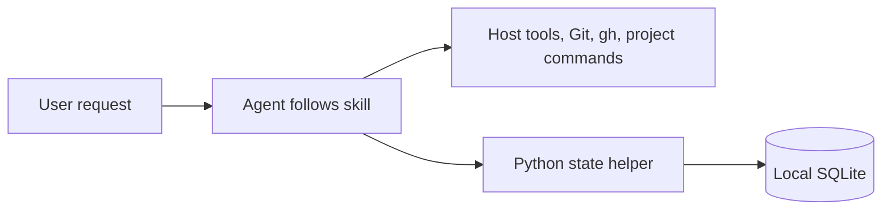
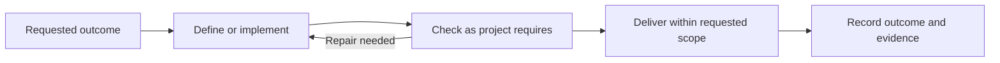

# Devflow

Small development skills for an agent, with a Python helper that records work and reports metrics. The agent follows the relevant skill and uses its host tools, Git, GitHub CLI and project commands directly.

## Prerequisites

Supply Python 3.12+, a POSIX shell, Git, a host that discovers `SKILL.md` directories, and the tools required by your projects. GitHub work requires `gh` authenticated to the relevant account and repository. Other host and service tools need their usual authentication and permissions. Devflow does not check or install prerequisites or manage authentication; behavior with missing prerequisites is undefined.

## Install

Keep the clone at a stable location; installed skills are symlinks into it.

```sh
git clone git@github.com:ebarti/devflow.git
cd devflow
bash scripts/install.sh
```

The default destination is `~/.agents/skills`. Supply another host's skill directory when needed:

```sh
bash scripts/install.sh /path/to/host/skills
```

The installer reports conflicting paths and preserves them. Update the original clone to update its linked skills. Installation writes skill links only; it does not change global instructions, host configuration or target repositories.

## Start

Ask for the outcome you want, for example: “Use devflow to fix the retry bug in this repository.” Or invoke a role such as `$devflow-reviewing` for a specific review. Skills are independently discoverable; loading one does not create work, issues or agents, or resume a backlog.

| Skill | Use |
| --- | --- |
| [devflow](skills/devflow/SKILL.md) | Shared method, role selection and state helper |
| [using-devflow](skills/using-devflow/SKILL.md) | Alias for choosing a role |
| [devflow-defining-work](skills/devflow-defining-work/SKILL.md) | Clarify outcomes and investigate unclear requests |
| [devflow-planning](skills/devflow-planning/SKILL.md) | Plan consequential changes and coverage |
| [devflow-coordinating](skills/devflow-coordinating/SKILL.md) | Carry out a defined request and recover ongoing work |
| [devflow-implementing](skills/devflow-implementing/SKILL.md) | Implement or repair code |
| [devflow-reviewing](skills/devflow-reviewing/SKILL.md) | Review a candidate and verify findings |
| [devflow-verifying](skills/devflow-verifying/SKILL.md) | Reproduce behavior and run project checks |
| [devflow-delivering](skills/devflow-delivering/SKILL.md) | Publish, merge or reconcile requested delivery |

## How it works



Enter at the role that fits the request. A small fix needs no separate planning exercise; a review-only request starts with review. Project rules determine checks, independent review and delivery requirements.



The helper stores work, runs, results, findings and agent-supplied usage. It does not execute tools or enforce a workflow. Its default database is `$XDG_STATE_HOME/devflow/workflow.sqlite3`, or `~/.local/state/devflow/workflow.sqlite3` when that variable is unset. See [helper commands](skills/devflow/references/state.md) and [storage contracts](docs/implementation-contracts.md).

## Installation smoke check

```sh
bash scripts/check-install.sh
```

Devflow CI runs only this installation smoke check. It does not run package test suites, review/QA gates or delivery automation. Target projects retain their own check policies.

[Architecture](docs/architecture.md) · [Contributor guide](docs/implementation-plan.md)
