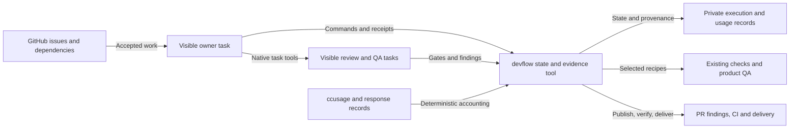
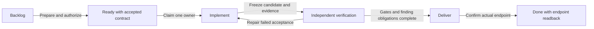

# Development workflow architecture

## Responsibilities and integrations

<!-- mermaid:id=components -->

```mermaid
flowchart LR
  issues["GitHub issues and dependencies"]
  owner["Visible owner task"]
  roles["Visible review and QA tasks"]
  engine["devflow state and evidence tool"]
  store["Private execution and usage records"]
  checks["Existing checks and product QA"]
  github["PR findings, CI and delivery"]
  usage["ccusage and response records"]
  issues -->|Accepted work| owner
  owner -->|Native task tools| roles
  owner -->|Commands and receipts| engine
  roles -->|Gates and findings| engine
  engine -->|State and provenance| store
  engine -->|Selected recipes| checks
  engine -->|Publish, verify, deliver| github
  usage -->|Deterministic accounting| engine
%% portable-canonical-v2:eyJhY2Nlc3NpYmlsaXR5IjpudWxsLCJkYXRhIjp7ImRpcmVjdGlvbiI6IkxSIiwiZWRnZXMiOlt7ImZyb20iOiJpc3N1ZXMiLCJsYWJlbCI6IkFjY2VwdGVkIHdvcmsiLCJ0byI6Im93bmVyIn0seyJmcm9tIjoib3duZXIiLCJsYWJlbCI6Ik5hdGl2ZSB0YXNrIHRvb2xzIiwidG8iOiJyb2xlcyJ9LHsiZnJvbSI6Im93bmVyIiwibGFiZWwiOiJDb21tYW5kcyBhbmQgcmVjZWlwdHMiLCJ0byI6ImVuZ2luZSJ9LHsiZnJvbSI6InJvbGVzIiwibGFiZWwiOiJHYXRlcyBhbmQgZmluZGluZ3MiLCJ0byI6ImVuZ2luZSJ9LHsiZnJvbSI6ImVuZ2luZSIsImxhYmVsIjoiU3RhdGUgYW5kIHByb3ZlbmFuY2UiLCJ0byI6InN0b3JlIn0seyJmcm9tIjoiZW5naW5lIiwibGFiZWwiOiJTZWxlY3RlZCByZWNpcGVzIiwidG8iOiJjaGVja3MifSx7ImZyb20iOiJlbmdpbmUiLCJsYWJlbCI6IlB1Ymxpc2gsIHZlcmlmeSwgZGVsaXZlciIsInRvIjoiZ2l0aHViIn0seyJmcm9tIjoidXNhZ2UiLCJsYWJlbCI6IkRldGVybWluaXN0aWMgYWNjb3VudGluZyIsInRvIjoiZW5naW5lIn1dLCJub2RlcyI6W3siaWQiOiJpc3N1ZXMiLCJsYWJlbCI6IkdpdEh1YiBpc3N1ZXMgYW5kIGRlcGVuZGVuY2llcyJ9LHsiaWQiOiJvd25lciIsImxhYmVsIjoiVmlzaWJsZSBvd25lciB0YXNrIn0seyJpZCI6InJvbGVzIiwibGFiZWwiOiJWaXNpYmxlIHJldmlldyBhbmQgUUEgdGFza3MifSx7ImlkIjoiZW5naW5lIiwibGFiZWwiOiJkZXZmbG93IHN0YXRlIGFuZCBldmlkZW5jZSB0b29sIn0seyJpZCI6InN0b3JlIiwibGFiZWwiOiJQcml2YXRlIGV4ZWN1dGlvbiBhbmQgdXNhZ2UgcmVjb3JkcyJ9LHsiaWQiOiJjaGVja3MiLCJsYWJlbCI6IkV4aXN0aW5nIGNoZWNrcyBhbmQgcHJvZHVjdCBRQSJ9LHsiaWQiOiJnaXRodWIiLCJsYWJlbCI6IlBSIGZpbmRpbmdzLCBDSSBhbmQgZGVsaXZlcnkifSx7ImlkIjoidXNhZ2UiLCJsYWJlbCI6ImNjdXNhZ2UgYW5kIHJlc3BvbnNlIHJlY29yZHMifV19LCJkZXNjcmlwdGlvbiI6bnVsbCwiaWQiOiJjb21wb25lbnRzIiwia2luZCI6ImZsb3djaGFydCIsInNvdXJjZVNoYTI1NiI6IjA3NGE1ODAzOWVkYmY4MWU0Njc0MWZkNDA5NThhMGMwZGE3MjAyMGRkNjJlZWU4OTM2NjU2MTVlYTUzMjQ2MzYiLCJzdHlsZXMiOltdLCJ0aXRsZSI6IlJlc3BvbnNpYmlsaXRpZXMgYW5kIGludGVncmF0aW9ucyIsInZlcnNpb24iOjF9
```

## Work lifecycle and repair

<!-- mermaid:id=lifecycle -->

```mermaid
flowchart LR
  backlog["Backlog"]
  ready["Ready with accepted contract"]
  implement["Implement"]
  verify["Independent verification"]
  deliver["Deliver"]
  done["Done with endpoint readback"]
  backlog -->|Prepare and authorize| ready
  ready -->|Claim one owner| implement
  implement -->|Freeze candidate and evidence| verify
  verify -->|Repair failed acceptance| implement
  verify -->|Gates and finding obligations complete| deliver
  deliver -->|Confirm actual endpoint| done
%% portable-canonical-v2:eyJhY2Nlc3NpYmlsaXR5IjpudWxsLCJkYXRhIjp7ImRpcmVjdGlvbiI6IkxSIiwiZWRnZXMiOlt7ImZyb20iOiJiYWNrbG9nIiwibGFiZWwiOiJQcmVwYXJlIGFuZCBhdXRob3JpemUiLCJ0byI6InJlYWR5In0seyJmcm9tIjoicmVhZHkiLCJsYWJlbCI6IkNsYWltIG9uZSBvd25lciIsInRvIjoiaW1wbGVtZW50In0seyJmcm9tIjoiaW1wbGVtZW50IiwibGFiZWwiOiJGcmVlemUgY2FuZGlkYXRlIGFuZCBldmlkZW5jZSIsInRvIjoidmVyaWZ5In0seyJmcm9tIjoidmVyaWZ5IiwibGFiZWwiOiJSZXBhaXIgZmFpbGVkIGFjY2VwdGFuY2UiLCJ0byI6ImltcGxlbWVudCJ9LHsiZnJvbSI6InZlcmlmeSIsImxhYmVsIjoiR2F0ZXMgYW5kIGZpbmRpbmcgb2JsaWdhdGlvbnMgY29tcGxldGUiLCJ0byI6ImRlbGl2ZXIifSx7ImZyb20iOiJkZWxpdmVyIiwibGFiZWwiOiJDb25maXJtIGFjdHVhbCBlbmRwb2ludCIsInRvIjoiZG9uZSJ9XSwibm9kZXMiOlt7ImlkIjoiYmFja2xvZyIsImxhYmVsIjoiQmFja2xvZyJ9LHsiaWQiOiJyZWFkeSIsImxhYmVsIjoiUmVhZHkgd2l0aCBhY2NlcHRlZCBjb250cmFjdCJ9LHsiaWQiOiJpbXBsZW1lbnQiLCJsYWJlbCI6IkltcGxlbWVudCJ9LHsiaWQiOiJ2ZXJpZnkiLCJsYWJlbCI6IkluZGVwZW5kZW50IHZlcmlmaWNhdGlvbiJ9LHsiaWQiOiJkZWxpdmVyIiwibGFiZWwiOiJEZWxpdmVyIn0seyJpZCI6ImRvbmUiLCJsYWJlbCI6IkRvbmUgd2l0aCBlbmRwb2ludCByZWFkYmFjayJ9XX0sImRlc2NyaXB0aW9uIjpudWxsLCJpZCI6ImxpZmVjeWNsZSIsImtpbmQiOiJmbG93Y2hhcnQiLCJzb3VyY2VTaGEyNTYiOiJlNWIwZjhlNDliZmRjZjg3MWFkOWM2MGY3ZjIyMDAyYjA2NjI2YzA2MzMzYWJmMDg2ZDI1ZWY5YmI0MTJmZWY1Iiwic3R5bGVzIjpbXSwidGl0bGUiOiJXb3JrIGxpZmVjeWNsZSBhbmQgcmVwYWlyIiwidmVyc2lvbiI6MX0
```
